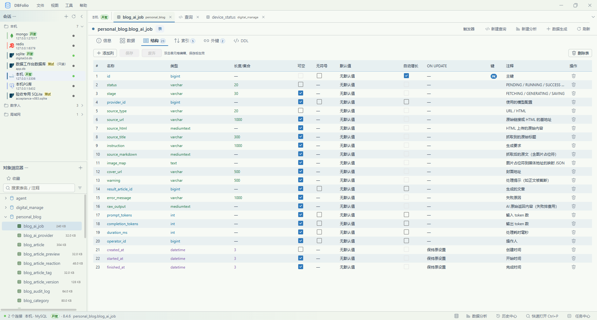
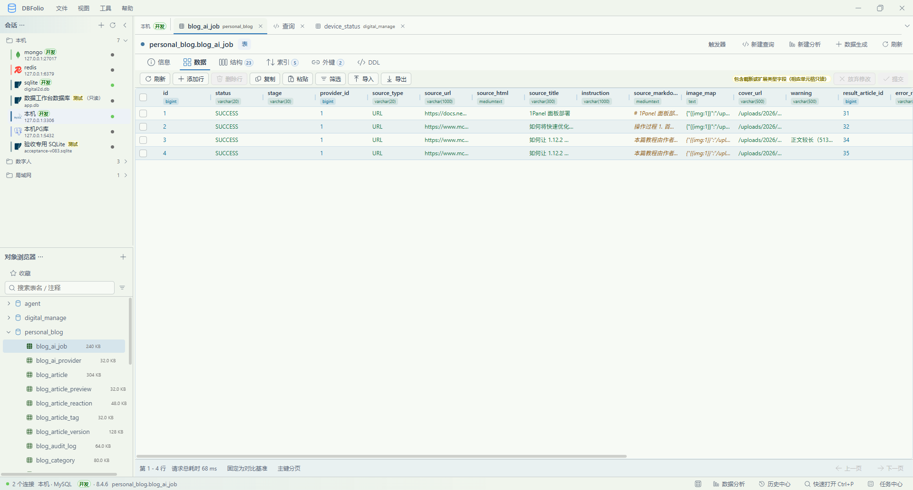
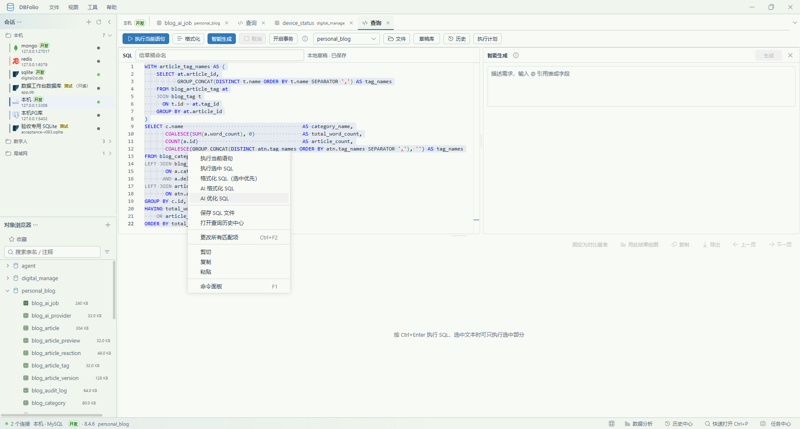
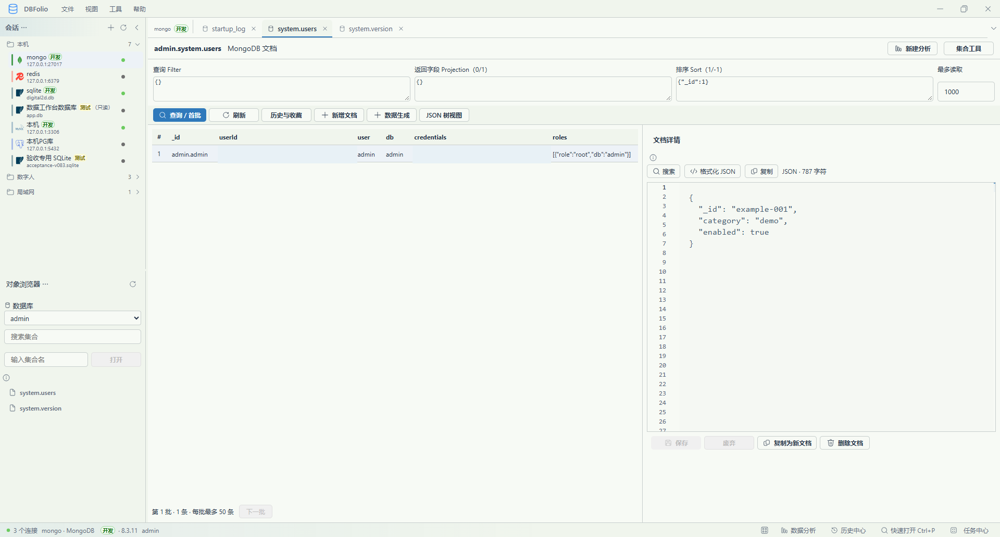
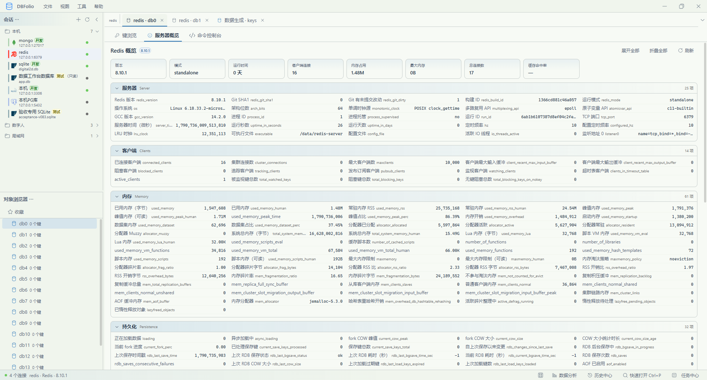

<p align="center">
  
</p>

# DBFolio

[简体中文](README.md) · [English](README.en.md)

面向开发者的 Windows 桌面数据库工作台：在一个应用中管理连接、编写 SQL、编辑数据和表结构、比较并同步数据库，以及分析和导出结果。

基于 **Tauri 2、React、TypeScript 和 Rust** 构建，支持 **MySQL、PostgreSQL、SQLite、Redis 和 MongoDB**，采用 **MIT 协议**开源。

> 项目仍在持续迭代，以 Windows 为开发和验证平台。五种数据库共用一致的操作原则，能力覆盖和成熟度不同；执行写入、同步或导出前，请先阅读下方的[支持范围与使用边界](#support)。

> 任务中心展示导入、导出、同步、数据生成、AI 等后台作业；普通查询在查询页查看结果和停止执行。索引/外键按字段类型配色，DDL 与查询编辑器共用 SQL 高亮。

**目录**

[为什么使用](#why) · [界面预览](#screenshots) · [主要功能](#features) · [支持范围](#support) · [快速上手](#quick-start) · [源码开发](#development) · [本地数据](#local-data) · [项目结构](#project-structure) · [贡献](#contributing) · [协议](#license)

<a id="why"></a>
## 为什么使用 DBFolio

- **一处处理日常数据库工作：** 会话、对象树、查询、表数据、结构、分析、同步和任务进度共用同一个多标签工作区。
- **先看清，再写入：** 表格修改先暂存，提交前可查看逐行差异和 SQL，并选择本次要提交的行；结构与同步操作也先展示计划。
- **适合多环境切换：** 会话可分组、标记环境、复制配置；生产环境默认只读，MySQL 可限制此客户端显示和操作的数据库。
- **保持本地可用：** 不需要注册账号或部署配套服务器；AI 是自行配置的可选能力。
- **紧凑的桌面界面：** 提供深浅色与纯黑（OLED）主题、强调色、布局和动效设置，常用操作可通过快捷键完成。

<a id="screenshots"></a>
## 界面预览

### 表结构

双击单元格可就地修改字段；结构、索引、外键和 DDL 集中在表标签页内，修改先暂存再保存。



### 表数据

紧凑的数据网格显示字段类型，支持分页、筛选以及先预览再提交的行编辑。



### SQL 编辑器

编辑器提供语法高亮、选区执行、格式化和可选的 AI 辅助；图中展示了选中 SQL 的右键操作。



### MongoDB 文档

集合页可设置筛选、返回字段和排序，并在右侧查看文档详情。截图中的凭据内容已替换为示例数据。



### Redis 概览

按服务器、客户端、内存等分组查看 Redis 状态，并可从左侧切换逻辑库与键浏览。



<a id="features"></a>
## 主要功能

### 会话管理

- 管理多个数据库连接，支持分组、环境标记、会话复制和收藏。
- SQLite 文件可直接拖入窗口或新建会话表单，自动填写数据库类型、文件路径和会话名，点击保存即可添加；名称重复自动追加编号，手动名称保留。一次一个文件，按文件头识别，也支持无扩展名的 SQLite 文件；不复制或修改原文件。
- 连接安全支持单跳 SSH、主机指纹确认、TLS 证书与服务器名校验、独立连接和查询超时；测试连接显示分阶段诊断。
- 多标签页可拖动排序、换行展示或恢复最近关闭的页签；支持工作区布局、快速打开和专注模式。
- 生产环境标记默认开启只读；关闭只读需要确认。MySQL 会话可设置允许访问的数据库列表，系统数据库仍遵守账号权限和会话范围。
- 首选项可查看本地存储大小、会话数和历史记录，设置历史保留数量、清理记录并回收本地数据库空闲空间。

### SSH、TLS 与连接诊断

新建或编辑会话时展开「连接安全与超时」：

1. 数据库地址填写从 SSH 服务器可以访问的地址，再填写 SSH 主机、用户及密码或私钥文件。获取指纹后，与管理员提供的 SHA256 指纹核对，再点击「已核对，信任此指纹」。主机或端口改变会清除信任，指纹不一致时拒绝连接。
2. MySQL/PostgreSQL 在 SSL 模式中选择策略：`prefer` 允许回退明文，`require` 强制加密，`verify-ca` 校验证书链，`verify-full` 额外校验数据库服务器名。SSH 转发时仍校验数据库服务器身份。
3. Redis/MongoDB 单主机模式勾选 TLS 后校验证书链和服务器名；可选择 CA、客户端证书与私钥 PEM。MongoDB URI/SRV 仅支持直连，客户端认证需使用包含证书和私钥的同一个 PEM，私钥栏留空；SSH 使用单主机模式，不发现整个副本集。
4. 连接超时默认 15 秒（1～120），查询等待默认 60 秒（1～3600）。查询超时表示客户端停止等待，不代表服务器已回滚，也不会自动重放语句。连接超时覆盖本次连接及诊断全流程；批量导入、同步等任务仍使用各自的取消与超时策略。
5. 测试完成后按阶段查看结果和耗时。默认库可访问不代表有全部对象的读写权限，后续操作仍由服务器校验。

SSH 密码和私钥口令保存在 Windows 凭据管理器，编辑时留空保留，清除需勾选对应选项；配置库仅保存路径和指纹。私钥及证书文件仍需在原路径可读。当前不支持多跳 SSH、代理链和 SSH agent。实际验收范围见 [R04 验收记录](docs/verification/r04.md)。

### 新建关系型数据库表

在数据库右键菜单选择“新建表”，打开独立的 **“新建表*”** 标签页。信息页填写表名、注释与适用的表选项；结构页添加字段并双击单元格编辑，支持主键、默认值及自动增长；索引和外键在各自页内编辑并暂存，DDL 页可查看建表 SQL。点击顶部“保存”统一创建，成功后原标签页转为正式表详情并显示数据页；失败保留草稿。支持 MySQL、PostgreSQL、SQLite，未保存草稿可“废弃”，关闭时会提示处理。

### 查询与数据编辑

- SQL 编辑器支持语法高亮、格式化、表和字段补全；可执行光标所在语句或选中内容，查看结果、执行历史和执行计划。
- 可打开/保存 SQL 文件，保留本地草稿；MySQL、PostgreSQL、SQLite 的查询页支持手动事务（限受支持的单条查询或 DML）。
- 数据库概览展示表/视图、估算行数、大小、引擎和注释；表数据支持分页、排序和组合筛选。每页最大查询行数可在首选项设为 1～5000，默认 200。筛选值建议只来自**当前已加载的行**。
- 表格编辑支持新增、修改、删除，先暂存再预览逐行前后值与 SQL，可选择部分行提交；无主键等无法可靠定位的结果保持只读。
- 查看表信息、列、索引、外键和 DDL，预览结构修改。MySQL、PostgreSQL、SQLite 共用双击行内编辑与保存/废弃：支持字段名、类型、长度/集合、可空和默认值；注释、自增、无符号、ON UPDATE 按引擎能力提供。SQLite 必要的列修改在事务内重建并保留依赖，失败回滚；MySQL 表属性提供服务器支持的引擎、字符集、排序规则等选择项。
- 字符串中的 Base64 图片可尝试显示缩略图，点击查看完整图片或原始文本；支持常见位图与 Data URL，兼容 PNG 格式别名和带参数的头部；高分辨率图片按缩小位图预览，详情可切换原始尺寸并导出原图文件（保留原始字节）。截断值仅在有主键的表数据中限量补读，无法识别、读取或超限时保持文本，详见 [图片预览范围](docs/verification/base64-images-alpha5.md)。
- 可保存当前结果快照并与后续结果比较，也可为字段配置业务关联并从记录跳转查看关联数据。

### 数据与结构同步

- 在独立标签页选择源和目标会话、数据库及表，分别比较结构和数据，预览计划后再执行。
- MySQL 结构同步支持按差异选择字段、索引、外键及部分表属性；执行前检查目标结构是否发生变化。PostgreSQL、SQLite 的结构变更范围更有限。
- 数据同步按主键比较并分批写入，可为源表设置筛选条件；删除目标多余行默认关闭，筛选源数据时不允许同时删除目标额外行。
- 当前仅支持 MySQL → MySQL、PostgreSQL → PostgreSQL、SQLite → SQLite，不支持跨引擎同步。数据写入前生成回滚材料；**结构同步不提供自动回滚**。

### 数据分析

- 可从当前查询结果建立绘图快照，或新建独立分析方案并编写查询；MongoDB 可使用聚合结果绘图。
- 提供柱形、横向条形、折线、面积、饼图、环图、散点、直方图和指标卡九种展示；配置分类、数值、聚合与排序，查看分类明细。
- 可关联业务名称或字段备注，保存方案后重新执行；支持导出 PNG 图片、图表 CSV 和数据 JSON。

### 智能生成与测试数据

- 在查询和分析的 SQL 编辑区域中输入自然语言需求，使用 `@` 引用表或字段；根据数据库上下文生成 SQL，生成结果不会自动执行。
- 可对选中的 SQL 使用 AI 格式化或优化；调用前后都会检查可解析的语法，候选结果需人工审阅。
- 支持本地规则与模板生成测试数据，以及通过配置的 AI 服务生成内容。
- 测试数据可先预览，再选择导出或写入。
- AI 为可选功能，需自行配置兼容服务；普通数据库操作不依赖 AI 服务。

### 文件与专用数据库工具

- 关系型表支持 CSV/TSV 文本导入；表数据或查询结果可导出当前页或全部数据，格式为 CSV、JSON、Excel（.xlsx）。
- MySQL SQL 文件导入提供独立页签、编码选择、流式预检、库切换/建删库提示、逐语句执行和本地报告，支持 `DELIMITER` 与存储程序。默认遇错停止，取消在语句边界生效，断线结果标为待核对。
- MySQL SQL 导出支持普通表、视图、过程、函数、触发器和事件；可选仅结构、仅数据或全部，支持建库字符集/排序规则、目标库映射、DEFINER 处理、单文件/按对象拆分及 ZIP。导入与导出选项可保存为本地方案，不保存密码、文件内容和筛选值。
- MySQL 数据库对象管理提供分类搜索、定义编辑、差异预览、创建/修改/删除、静态依赖提示、视图预览和过程参数/多结果展示；显示事件调度器状态，表页提供触发器入口。
- Redis 支持键扫描与搜索、常见类型的值和成员编辑、TTL、批量删除及命令控制台。
- MongoDB 支持集合与文档浏览、筛选和编辑、集合统计、索引、字段抽样、只读聚合，以及 Extended JSON 数组/JSON Lines 导入导出（导入仅新增）。

<a id="support"></a>
## 支持范围与使用边界

| 数据库 | 主要能力 | 当前边界 |
|---|---|---|
| MySQL | 查询、表格与结构编辑、分析、同引擎同步、SQL 导入导出、五类数据库对象管理 | 新增导入/对象/完整导出已在 MySQL 8.4.6 实测；存储程序编辑为 SQL 定义编辑，不是可视化流程编辑 |
| PostgreSQL | 查询、表格与结构编辑、分析、同引擎同步 | 部分主键、索引和外键重建需手工处理 |
| SQLite | 本地文件库、查询、表格及行内结构编辑、分析、同引擎同步 | 结构页列修改支持事务重建；外键编辑、特殊列定义及结构同步重建仍需手工处理 |
| Redis | 键管理、TTL、命令控制台、测试数据生成 | 不参与关系型结构/数据同步 |
| MongoDB | 集合/文档操作、聚合、索引、JSON/JSONL 传输与分析 | 不参与关系型结构/数据同步；导入仅插入文档 |

各引擎的操作能力并不完全相同，界面会根据数据库类型、对象类型和只读状态提供可用入口。尤其需要注意：

- **安全控制有范围。** 只读模式、危险 SQL 检查和 MySQL 数据库范围限制用于降低客户端误操作，不是完整 SQL 沙箱，也不能替代服务端账号权限与备份。生产库建议使用数据库侧最小权限账号。
- **同步先预览。** 同步仅支持同引擎；缺少主键的表会跳过数据同步。结构同步的已执行 DDL 不会自动撤销，SQLite 结构同步不自动重建表（结构页列编辑的事务重建另行支持）。数据同步的反向 SQL 材料保存在 `%APPDATA%\data-workbench\sync-backups\<任务ID>`，不能替代数据库备份。
- **显示的数据可能只是局部。** 数据库概览行数来自元数据估算；筛选值建议仅取当前已加载页。查询结果绘图和结果比较以当前结果范围为准；图表数值使用浮点近似，不用于精确财务核算。
- **外部服务连接需要自行验证。** 功能覆盖不代表所有数据库版本和服务器配置都已实机验收；在重要数据上执行写入、结构变更或同步前，请先用测试环境确认行为。

<a id="quick-start"></a>
## 运行与快速上手

### 运行环境

- Windows 桌面环境，当前主要面向 Windows 10 / 11。
- Microsoft Edge WebView2 Runtime。
- 可访问的数据库服务，或本地 SQLite 文件。

发布 Windows 构建后，可从仓库的 **Releases** 页面下载安装版（`setup.exe`）或便携版（`portable.zip`）；发布包尚未提供时，可按下文从源码构建。便携版需完整解压后运行目录内的 `DBFolio.exe`，并需要系统 WebView2 运行环境。

### 首次使用

1. 通过「文件 → 新建连接」创建会话，选择数据库类型并填写连接参数；SQLite 选择数据库文件。
2. 按用途设置环境标记和只读模式。MySQL 可启用「仅允许指定数据库」，避免在同一服务器上误选其他库。
3. 测试连接并保存。点击数据库可先查看表/视图概览，再打开表；也可新建查询并按 `Ctrl+Enter` 执行光标所在语句或选中 SQL。
4. 修改表数据后，先查看待提交差异和 SQL，再选择行并提交。删除行同样需要提交才能写入数据库。
5. 需要图表时，使用当前查询结果绘图或新建独立分析；需要同步时，从「工具 → 数据同步」选择同引擎源/目标，核对计划后执行。

智能生成功能需先在「文件 → 首选项」配置 AI 服务。AI 提供的 SQL 只会放入编辑器，需人工确认后执行。

### MySQL SQL 文件与数据库对象

1. 选中 MySQL 会话，在「文件 → 导入 SQL 文件」打开独立页签；也可右键数据库进入。选择目标库、文件和编码，预检后核对作用范围，勾选确认并选择报告目录执行。
2. 「文件 → MySQL 数据库对象」或数据库右键「管理数据库对象」可管理视图、过程、函数、触发器和事件。编辑单条 `CREATE` 定义，预览差异后执行；不要在定义中添加 `DELIMITER` 或其他语句。
3. 「导出 SQL 文件」勾选整库或所需表/对象类型。迁往其他库时填写恢复目标库；保留 DEFINER 需要目标服务器存在对应账号和权限。ZIP 先解压，拆分文件按编号逐个导入。
4. 方案保存在本机配置中；使用旧方案时重新核对目标与对象。SQL 导入方案恢复编码和错误策略，目标不一致时提示手动重选；SQL 导出方案恢复目标映射及选项，已失效表/筛选字段会阻止导出。

边界：单条 SQL 最大 64 MiB，预检快照有效期 30 分钟；不支持 `SOURCE`、shell、客户端连接切换或 `NO_BACKSLASH_ESCAPES / ANSI_QUOTES` 模式。DDL 和已提交数据不会因取消自动撤销，未提交事务在结束时回滚；断线或过程异常可能部分写入，不自动重试。受数据库白名单限制的会话会拒绝无法可靠检查范围的存储程序及脚本语句。对象替换采用 `DROP + CREATE`，部分 MySQL 存储程序不能预编译校验，失败时需使用保留的原定义恢复。目标库映射不修改字符串中的动态 SQL；静态依赖不等于完整依赖分析。更多验收信息见 [R01–R03 验证记录](docs/verification/r01-r03.md)。

常用快捷键：`Ctrl+P` 快速打开和搜索命令，`Ctrl+Enter` 执行 SQL，`Ctrl+S` 保存 SQL 文件，`Ctrl+,` 打开首选项，`Ctrl+B` 切换会话栏。完整列表可在首选项中查看。

<a id="development"></a>
## 从源码开发

### 环境准备

- Node.js **22.12 或更高版本**及 npm。
- Rust stable 与 Cargo（项目当前使用 1.98.1 MSVC 工具链）。
- Visual Studio 2022 Build Tools，安装「使用 C++ 的桌面开发」及 Windows SDK。
- Microsoft Edge WebView2 Runtime。
- 将 `%USERPROFILE%\.cargo\bin` 加入 `PATH`。

以下命令均在项目根目录的 PowerShell 中运行。项目包含 npm 与 Cargo 锁文件，建议保留并使用它们。应用的前端使用 React、TypeScript、Fluent UI v9，桌面与数据库层使用 Tauri 2、Rust 和 sqlx。

### 安装依赖并启动

```powershell
npm ci
npm run tauri dev
```

首次运行会下载并编译 Rust 依赖，耗时较长。

`src-tauri/vendor/sqlx-mysql` 保留 SQLx 0.8.6 的最小本地修复，用服务器字符集编号区分 `_bin` 文本与真正的二进制字段；构建时需保留该目录。来源、许可证和升级注意事项见[补丁说明](src-tauri/vendor/sqlx-mysql/DBFOLIO-PATCH.md)。

`npm run dev` 仅启动前端开发服务器；完整数据库功能需要通过 `npm run tauri dev` 启动桌面应用。

### 构建与检查

```powershell
# 前端类型检查及构建
npm run build

# Rust 检查
cargo check --manifest-path src-tauri/Cargo.toml

# Rust 测试
cargo test --manifest-path src-tauri/Cargo.toml
```

涉及真实外部数据库的测试需按测试要求准备环境；跳过的集成测试不表示对应服务已经通过验证。

### 生成 Windows 安装包与便携版

```powershell
# 正式构建：安装包 + 便携目录和 ZIP，启用 LTO 优化
npm run app:build

# 仅生成正式便携版
npm run app:portable

# 测试构建：同样生成完整便携目录和 ZIP，关闭 LTO
npm run app:build:fast
```

对外版本从 `1.0.0-alpha` 起算，后续 alpha 迭代使用 `1.0.0-alpha.1`、`1.0.0-alpha.2`。产物按版本归档，例如：

```text
release/
  1.0.0-alpha/
    DBFolio_1.0.0-alpha_windows_x64_setup.exe
    DBFolio_1.0.0-alpha_windows_x64_setup_SHA256SUMS.txt
    DBFolio_1.0.0-alpha_windows_x64_portable.zip
    DBFolio_1.0.0-alpha_windows_x64_portable_SHA256SUMS.txt
    DBFolio_1.0.0-alpha_windows_x64_portable/
      DBFolio.exe
      web/                    # HTML、CSS、JavaScript、编辑器等前端资源
      LICENSE
      distribution.json       # 版本、架构、构建配置与文件 SHA-256
      使用说明.txt
```

- 安装版 SHA256SUMS 校验安装 EXE；便携版 SHA256SUMS 校验 ZIP 和便携目录内的全部文件，路径相对于版本目录。不同版本互不覆盖。
- 测试构建也进入对应版本目录，使用 `portable-fast` 后缀和独立校验清单，避免覆盖正式产物。脚本当前支持 Windows x64 MSVC。
- **不再发布单文件 EXE。** 前端资源从 EXE 同目录的 `web/` 加载，EXE 只内置资源摘要清单；不要单独移动 EXE。程序启动时校验资源，缺失、损坏或版本混用会提示重新解压/安装。开发热重载仍使用 Vite。
- 安装版使用 NSIS，按当前用户安装；缺少 WebView2 时需联网下载安装运行时。便携包不包含 WebView2。
- 手动更新便携版时，先退出应用，将新包解压到新目录并整体替换程序文件；本地会话和凭据不在程序目录内。安装版可运行新版安装包升级。
- **在线更新尚未实现。** 目录布局与版本清单为后续更新做准备；安装版可接入 Tauri updater，便携版仍需实现整包替换与回滚。当前产物未配置 Windows 代码签名或更新签名。

<a id="local-data"></a>
## 本地数据与使用边界

| 内容 | 存储位置 |
|---|---|
| 会话配置、查询历史等本地数据 | `%APPDATA%\data-workbench\app.db` |
| 应用日志 | `%APPDATA%\data-workbench\logs` |
| 数据同步生成的反向 SQL 材料 | `%APPDATA%\data-workbench\sync-backups\<任务ID>` |
| 数据库密码、SSH 密码与私钥口令 | Windows 凭据管理器 |

- **无需账号。** 当前没有客户端账号或云端同步功能；会话和首选项保存在本机，迁移电脑时应分别处理本地数据库与系统凭据。
- **旧版数据保持可读。** 项目更名为 DBFolio 后，本地目录和凭据服务名仍沿用 `data-workbench`，以继续读取已有会话、历史与密码；这是兼容标识，不是旧产品名称。
- **只读和白名单是客户端保护。** 对生产环境仍应使用服务端只读账号和最小权限授权；客户端不能代替数据库权限隔离。
- **AI 请求会发往配置的服务。** 提示词、相关表结构、选中的 SQL 等上下文可能发送给该服务；主动输入的错误信息或业务内容也可能包含敏感信息，请按数据使用要求选择服务和输入内容。
- **生成的 SQL 需要检查。** 特别是修改数据、删除对象和调整索引的语句，应确认作用范围后再执行。
- **结构变更不一定能回滚。** 同步、导入或批量修改前，应准备适当备份；不要将所有数据库的 DDL 都视为事务操作。MongoDB 文档导入及分批写入已成功的部分也不会因后续取消而自动撤销。
- **分析结果取决于输入数据范围。** 从某页查询结果绘图不等于分析全库；数值统计使用浮点近似值，不适合作为精确财务核算结果。
- **免安装不代表配置随 EXE 移动。** 应用数据和凭据分别保存在上述位置。

<a id="project-structure"></a>
## 项目结构

```text
src/                  React / TypeScript 前端
  features/           会话、查询、同步、分析等功能
  stores/             前端状态管理
src-tauri/            Rust 与 Tauri 桌面端
  src/                数据库适配、应用服务、本地存储及 IPC
scripts/              构建与回归检查脚本
public/               静态资源
docs/                 设计文档、界面截图与功能验收记录
```

架构、设计决策和详细实现状态见 [设计文档](docs/design.md)。文档包含历史规划，判断当前能力时请结合「实现状态」和实际代码。

后续功能的优先级、实施顺序、验收条件及完成标记见 [功能路线图](docs/roadmap.md)。路线图中的未勾选项目为规划能力，不代表当前版本已支持。

<a id="contributing"></a>
## 问题反馈与贡献

欢迎提交问题、功能建议和 Pull Request。

报告问题时，请提供应用版本、Windows 版本、数据库类型与版本、复现步骤，以及预期和实际结果。截图、日志及 SQL 示例请先脱敏，不要公开密码、Token、连接凭据或真实业务数据。

提交代码前，请运行与改动相关的检查。功能和行为调整需同步更新 `docs/design.md` 中的实现状态与变更记录，具体约定见 [AGENTS.md](AGENTS.md)。

如涉及安全漏洞，请通过下方邮箱私下联系作者，避免在公开 Issue 中披露敏感细节。

## 作者

- **SerLiunx**
- 邮箱：[root@serliunx.com](mailto:root@serliunx.com)
- 主页：[https://www.serliunx.com](https://www.serliunx.com)

<a id="license"></a>
## 开源协议

本项目采用 [MIT 协议](LICENSE)，允许使用、复制、修改、分发和商用，包括闭源衍生版本；分发时须保留版权及许可声明。第三方依赖遵循各自的许可证。

Copyright (c) 2026 SerLiunx
